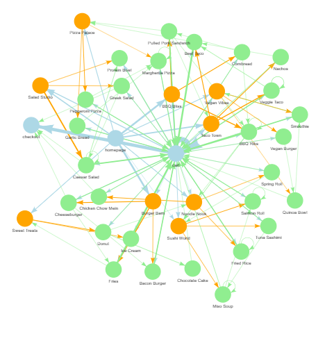
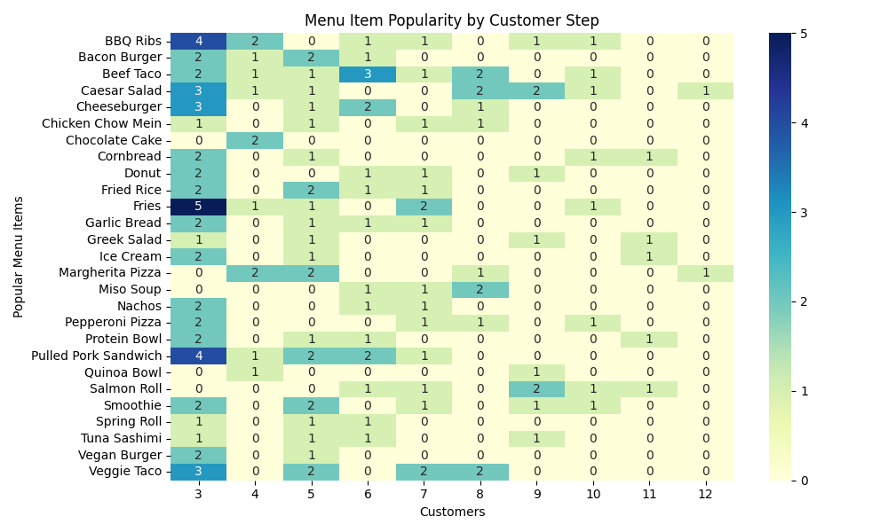
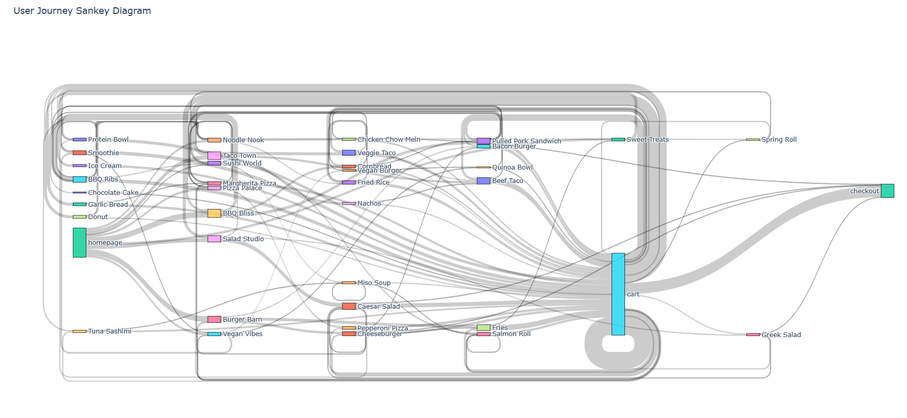
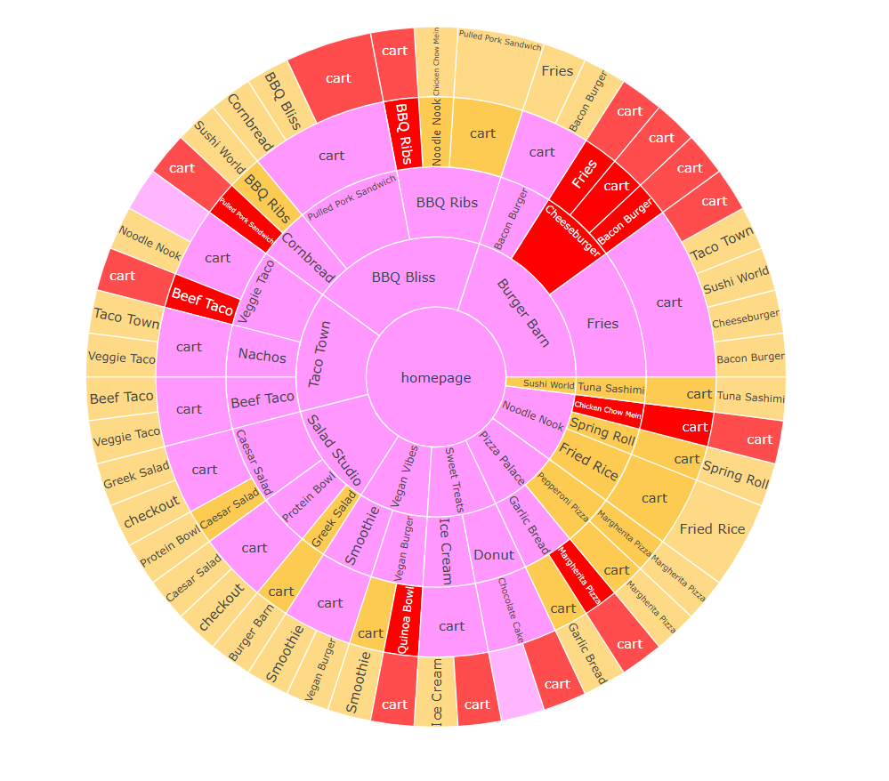

# 🧭 User Journey Analyzer Agent

**User Journey Analyzer Agent** is a Python-based analytics tool designed to simulate, process, and visualize user activity on a food delivery app. It includes AI-powered recommendations to help restaurants improve user conversions.

---

## 🚀 Features

✅ **Synthetic clickstream generator**
- Generates realistic user journeys with restaurants, menu items, cart actions, and checkouts  
- Configurable for sample size and complexity  

✅ **Visualization toolkit**
- **Sunburst chart**: Hierarchical journey overview  
- **Sankey diagram**: Flow of user actions  
- **Flow heatmap**: Popular menu items at each journey step  
- **Path frequency bar chart**: Top N most common user paths  
- **Interactive network graph**: Node-link diagram of user flows (restaurant vs menu item nodes)

✅ **AI recommendations**
- Uses OpenAI to generate actionable restaurant insights  
- Includes friction points and conversion suggestions  

---

## 📂 Project Structure
<pre>user-journey-analyzer-agent/
├── data/
│ └── big_sample_clickstream.csv
├── images/
│ ├── user_journey_sunburst.html
│ ├── user_journey_sankey.html
│ ├── flow_heatmap.png
│ ├── user_journey_network.html
│ └── path_frequency_bar.png
├── outputs/
│ └── ai_recommendations.md
├── src/
│ ├── analyzer.py
│ ├── visualizer.py
│ ├── recommender.py
│ └── config.py
├── .env
├── .gitignore
├── requirements.txt
└── README.md </pre>

## 🤖 Sample AI Recommendation Snippet
The tool analyzes user journeys and generates actionable advice for restaurants using the OpenAI API.
Here’s an example of the AI recommendations produced:

**Salad Studio:**
- **Summary:** Salad Studio had decent page views but users were more engaged with the Protein Bowl compared to other items. However, there was a high rate of users clearing items from their cart compared to checkouts.
- **Friction:** Users added Protein Bowl to the cart but many cleared it, indicating a potential issue with the item's appeal or pricing.
- **Suggestions:** Consider offering promotions or discounts on the Protein Bowl to incentivize checkouts. Provide clearer descriptions or images of the item to enhance its appeal.

**Burger Barn:**
- **Summary:** Burger Barn had good page views and engagement across its menu items, especially Fries and Bacon Burger.
- **Friction:** Despite items being added to carts, there was a notable drop-off at checkouts, suggesting a need for smoother payment processes or clearer pricing information.
- **Suggestions:** Implement a more user-friendly checkout process or offer combo deals to encourage users to complete their orders.

👉 The full AI output is saved as a Markdown file in outputs/ai_recommendations.md.

## 📊 Example Visualization outputs

### User journey Network map

### Popular Menu items Heat map

### Popular Menu items Heat map

### User Journey Sunburst map

## 🔧 How to run

1️⃣ Clone the repo:
git clone
[https://github.com/YOUR_USERNAME/user-journey-analyzer-agent.git](https://github.com/ApoorvaSaxena1/agentic-ai-sample-projects)
cd user-journey-analyzer-agent

2️⃣ Create and activate virtual environment:
python3.10 -m venv venv
source venv/bin/activate  # macOS/Linux
venv\Scripts\activate     # Windows

3️⃣ Usage: 
Generate sample data
    python generate_big_sample.py
Run analysis + visualizations + AI recommendations
    python src/analyzer.py
✅ Output will be in images/ + outputs/

## 💡 Sample data format
The sample_clickstream.csv file in data/ looks like:

user_id	timestamp	page	action	duration_on_page
u1	2024-06-21T09:00:00	homepage	view	5
u1	2024-06-21T09:00:05	signup	click	15
u1	2024-06-21T09:00:20	dashboard	view	30

## 🧠 AI agent

👉 Generates restaurant-level recommendations based on:

User paths
Drop-offs
Menu views
Cart actions

👉 Uses OpenAI API — set your key in .env:

OPENAI_API_KEY=sk-xxxxx

## 📝 Notes
.env is excluded from version control (.gitignore)
Visual outputs saved as both HTML + images
Project designed for easy extension (e.g., Streamlit UI, cloud deployment)

## 📌 To-do / future work
Add Streamlit app for interactive demo
Allow dynamic dataset uploads
Enhance AI prompt sophistication

## 🤝 Contributing
Pull requests welcome! For major changes, please open an issue first.

## ⚙ Tech Stack
Python 3.10 — main programming language
pandas — data processing and aggregation
matplotlib, seaborn, plotly, pyvis — data visualization (static and interactive)
networkx — network graph data structures
OpenAI API — AI-powered recommendations for restaurant insights
python-dotenv — secure environment variable management

(Optional for extension: HuggingFace Transformers, Streamlit)

